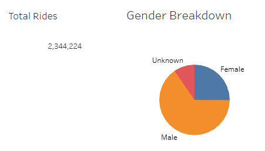
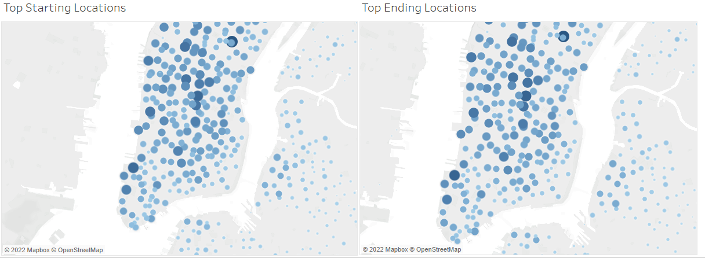
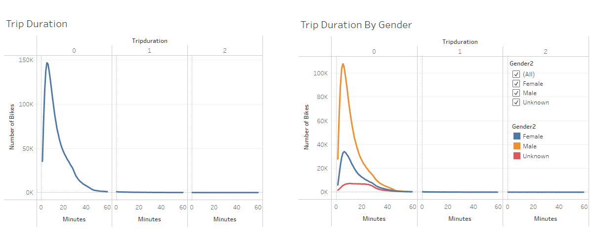
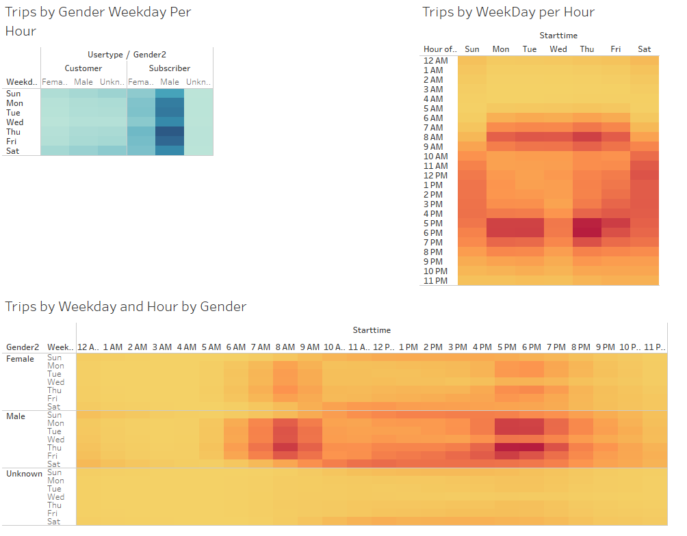

# Bike Sharing

## Link To Tableau
[https://public.tableau.com/app/profile/crystal.ho5302/viz/Bike_Trips_CrystalRae90/Story1](https://public.tableau.com/app/profile/crystal.ho5302/viz/Bike_Trips_CrystalRae90/Story1 "Link to Dashboard")

## Overview of the statistical analysis:

The purpose of this assignment was to review bike sharing data to convince investors that a bike-sharing program in Des Moines is a solid business prososal. 

## Results:

To analyze this data, it was first important to understand the data that was provided and get base data: 

<kbd></kbd>

The base data showed that the analyzed data contained over 2.3 Million rides with a split of mostly men as the users. There was a smaller percentage of rides where the gender was unknown. 

The second data point that was analyzed was to look at where the starting and ending locations for each ride was. 

<kbd></kbd>

This is showqn in the image above. Unfortunately there is no discernable data difference. It appears that hot spots for starting also appear to be good ending spots

The next set of data that was analyzed was on average how long each duraction of the trip was. Converting the duration into discerable dataset, we can see below that most trips are under an hour and even more so, over 90% is under 20 minutes. 

<kbd></kbd>

The data was able to be split multuple ways, showing pure time and then split by user gender. The data shows that those who did not mark a gender had a longer range of time usage but both men and women use it on average of 20 mins for their trips. 

Finally, we looked at the frequency in which the rides took place in relation to their user type gender, and then based on what time in the day. 

<kbd></kbd>

The top left image above shows that male subscribers tend to use the service the most of which Thursday and Fridays seem to be the highest. This coicides with what we had shown above with Men being the highest users. On the top right image, we see that early morning or early evening time frames appear to have the highest usage durin the week. The weekends however seem to have usage throughout the day. Finally the bottom image reinforces that data showing the split by gender and time frame rented. 

## Summary:

Overall, it appears that this program is successful primarily with male users via a subscription service.

While there are many factors, here are some facts we discovered: 
 -  Trips tend to be under 1 hour (20-30 min average) 
 -  Starting/Ending locations tend to be similar in usage data 
 -  There seems to be more usage from subscribers than non subscribers 
 -  Men is the primary demographic of users 

Some potential other graphics would include: 

- Grouping the DOB in age ranges would help the company understand the age demographic of the users. This could be graphed based on ride count to show this. 
- Graph to show distance over time could also be helpful. Understanding this distance may help the company understand what type of pricing model would be best. This would require figuring out the distance based on starting and ending lat/long. 

